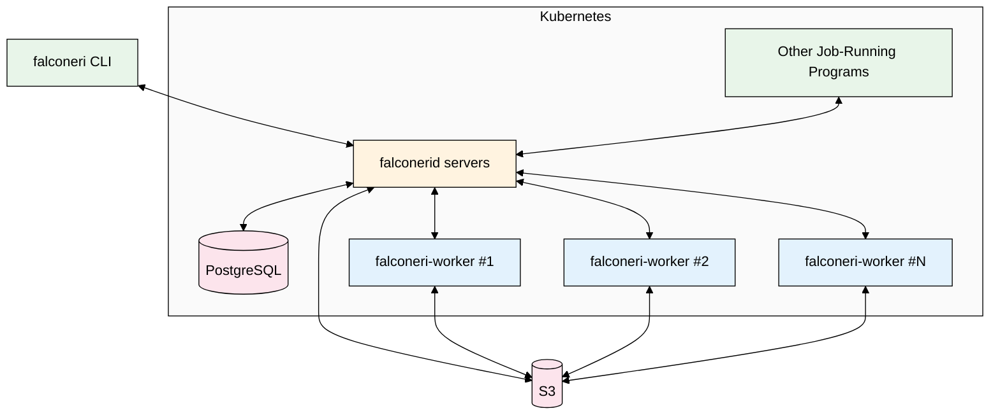

# Introduction

Falconeri is lightweight tool for running distributed batch jobs on a Kubernetes cluster. You can specify your processing code as a Docker image that reads files as input, and produces other files as output. This allows you to use virtually any programming language.

Falconeri will read files from cloud buckets, distribute them among multiple copies of your worker image, and collect the output into a another cloud bucket.

## Architecture

- **falconeri CLI**: Command-line tool for submitting jobs, monitoring progress, and managing deployments.
- **Other Job-Running Programs**: Any program that speaks the falconerid REST API can submit and manage jobs.
- **falconerid**: The central servers that coordinate job execution, manage worker assignments, and track job state. Multiple server instances provide high availability.
- **PostgreSQL**: Stores all job metadata, datum status, and file references as the authoritative source of truth. Using PostgreSQL probably limits us to a few thousand workers per cluster, but it simplifies the architecture tremendously.
- **falconeri-worker**: Runs your Docker image to process individual datums, downloading inputs from S3 and uploading outputs.
- **S3**: Cloud storage (S3, Google Cloud Storage or S3-compatible) for input files and output results.

Falconeri is inspired by the open source [Pachyderm][], which offers a considerably richer set of tools for batch-processing on a Kubernetes cluster, plus a `git`-like file system for tracking multiple versions of data and recording the provenance.

[Pachyderm]: http://www.pachyderm.io/
