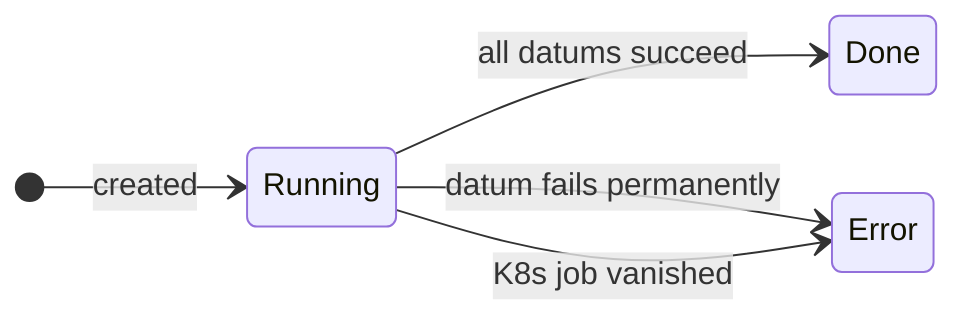
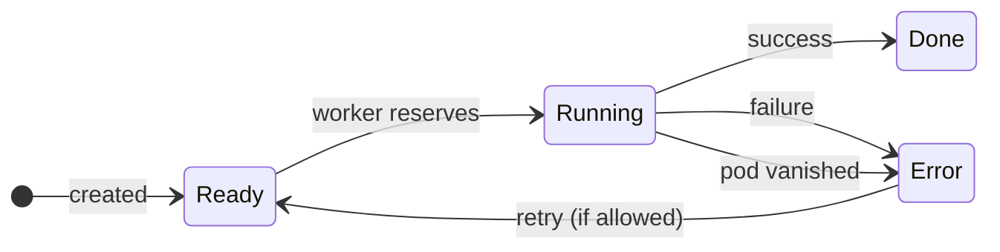
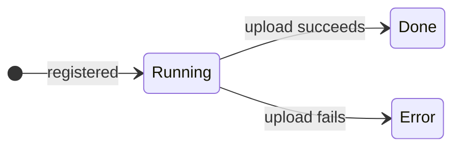

# Job Lifecycle

This page describes the complete lifecycle of a Falconeri job, from creation through completion.

## Sequence Diagram

The following diagram shows the interactions between components during job execution:

```mermaid
%%{init: {'theme': 'base', 'themeVariables': { 'actorLineColor': '#000000', 'signalColor': '#000000', 'signalTextColor': '#000000', 'labelTextColor': '#000000', 'loopTextColor': '#000000', 'noteBkgColor': '#ffffff', 'noteTextColor': '#000000', 'activationBorderColor': '#000000', 'sequenceNumberColor': '#000000', 'altSectionBkgColor': '#ffffff', 'labelBoxBorderColor': '#404040', 'labelBoxBkgColor': '#e8e8e8'}}}%%
sequenceDiagram
    autonumber

    actor User as User
    participant Server as falconerid
    participant DB as PostgreSQL
    participant K8s as Kubernetes
    participant Worker as falconeri-worker
    participant S3 as S3

    rect rgb(232, 245, 233)
        Note over User,S3: Job Creation
        User->>S3: s3 sync (upload inputs)
        User->>+Server: falconeri job run
        Server->>S3: List input files
        S3-->>Server: File list
        critical Transaction
            Server->>DB: INSERT job
            Note over DB: job.status ← Running
            Server->>DB: INSERT datums
            Note over DB: datum.status ← Ready
            Server->>DB: INSERT input_files
        end
        Server->>K8s: kubectl apply (batch job)
        Server-->>-User: job
        K8s->>Worker: Start pods
        activate Worker
    end

    rect rgb(227, 242, 253)
        Note over User,S3: Datum Processing (per worker, repeated)

        Worker->>+Server: POST /jobs/{id}/reserve_next_datum
        critical Transaction
            Server->>DB: SELECT datum FOR UPDATE
            Server->>DB: UPDATE datum
            Note over DB: datum.status ← Running<br/>datum.pod_name ← worker
        end
        Server-->>-Worker: datum + input_files

        Worker->>S3: Download inputs 
        S3-->>Worker: Input files to /pfs/<repo>

        Note over Worker: Run command

        Note over Worker: Scan /pfs/out/ for outputs

        Worker->>+Server: POST /datums/{id}/output_files
        critical Transaction
            Note over Server,DB: Check datum ownership
            Server->>DB: INSERT output_files
            Note over DB: output_file.status ← Running
        end
        Server-->>-Worker: output_files

        Worker->>S3: Upload outputs (sync_up)
        S3-->>Worker: Upload complete

        Worker->>+Server: PATCH /datums/{id}/output_files
        critical Transaction
            Note over Server,DB: Check datum ownership
            Server->>DB: UPDATE output_files
            Note over DB: output_file.status ← Done
        end
        Server-->>-Worker: 204 No Content

        Worker->>+Server: PATCH /datums/{id}
        critical Transaction
            Note over Server,DB: Check datum ownership
            Server->>DB: UPDATE datum
            Note over DB: datum.status ← Done
            Server->>DB: Check remaining datums
            alt Some datums remain
                Note over Server: Job continues
            else All datums complete
                Server->>DB: UPDATE job
                Note over DB: job.status ← Done
            end
        end
        Server-->>Worker: response
        deactivate Server
        deactivate Worker
    end

    rect rgb(255, 243, 224)
        Note over User,S3: Babysitter: Vanished Job Detection (periodic)
        Server->>K8s: List batch jobs
        K8s-->>Server: Job names
        Server->>DB: SELECT running jobs
        alt K8s job missing for >15min
            critical Transaction
                Server->>DB: SELECT job FOR UPDATE
                Server->>DB: UPDATE job
                Note over DB: job.status ← Error
            end
        end
    end

    rect rgb(255, 243, 224)
        Note over User,S3: Babysitter: Zombie Datum Detection (periodic)
        Server->>K8s: List running pods
        K8s-->>Server: Pod names
        Server->>DB: SELECT running datums
        alt datum.pod_name not in running pods
            critical Transaction
                Server->>DB: SELECT datum FOR UPDATE
                Server->>DB: UPDATE datum
                Note over DB: datum.status ← Error<br/>"worker pod disappeared"
            end
        end
        critical Transaction
            Server->>DB: Check remaining datums
            opt All datums complete
                Server->>DB: UPDATE job
                Note over DB: job.status ← Done/Error
            end
        end
    end

    rect rgb(255, 243, 224)
        Note over User,S3: Babysitter: Datum Retry (periodic)
        Server->>DB: SELECT errored datums with retries
        alt datum.attempted_run_count < maximum
            critical Transaction
                Server->>DB: SELECT datum FOR UPDATE
                Server->>DB: UPDATE datum
                Note over DB: datum.status ← Ready
                Server->>DB: DELETE output_files
            end
        end
    end

    rect rgb(232, 245, 233)
        Note over User,S3: During Job
        User->>+Server: falconeri job wait
        Server->>DB: Poll job status
        Server-->>-User: (blocks until done)
        User->>+Server: falconeri job describe
        Server->>DB: Query job details
        Server-->>-User: job details
    end

    rect rgb(252, 228, 236)
        Note over User,S3: After Job
        User->>S3: s3 sync (download outputs)
        S3-->>User: Output files
    end
```

## Status Transitions

### Job Status

| From | To | Trigger |
|------|-----|---------|
| *(created)* | `Running` | Job inserted into database |
| `Running` | `Done` | All datums succeed |
| `Running` | `Error` | Any datum fails permanently (exhausted retries) |
| `Running` | `Error` | Babysitter detects K8s job vanished (after 15min) |

### Datum Status

| From | To | Trigger |
|------|-----|---------|
| *(created)* | `Ready` | Datum inserted into database |
| `Ready` | `Running` | Worker reserves datum via POST /jobs/{id}/reserve_next_datum |
| `Running` | `Done` | Worker reports success via PATCH /datums/{id} |
| `Running` | `Error` | Worker reports failure via PATCH /datums/{id} |
| `Running` | `Error` | Babysitter detects worker pod vanished |
| `Error` | `Ready` | Babysitter re-queues datum for retry (if retries remain) |

### Output File Status

| From | To | Trigger |
|------|-----|---------|
| *(created)* | `Running` | Output file registered via POST /datums/{id}/output_files |
| `Running` | `Done` | Upload succeeds, reported via PATCH /datums/{id}/output_files |
| `Running` | `Error` | Upload fails, reported via PATCH /datums/{id}/output_files |

## REST API Summary

| Endpoint | Method | Description |
|----------|--------|-------------|
| `/jobs` | POST | Create a new job from pipeline spec |
| `/jobs/{id}` | GET | Get job by ID |
| `/jobs/{id}/reserve_next_datum` | POST | Reserve next available datum (worker) |
| `/datums/{id}` | PATCH | Update datum status (worker) |
| `/datums/{id}/output_files` | POST | Register output files before upload (worker) |
| `/datums/{id}/output_files` | PATCH | Update output file status after upload (worker) |

## Error Handling

### When a datum fails with a normal error:

1. The worker catches the error and calls `PATCH /datums/{id}` with `status: error`
2. The server stores the error message and backtrace
3. The babysitter periodically checks for failed datums with remaining retries
4. Eligible datums are reset to `Ready` status for another attempt
5. Only after exhausting all retries does the datum remain in `Error` status
6. When the last datum finishes (success or permanent failure), the job status is updated

### When a Kubernetes job vanishes mysteriously:

1. The babysitter periodically lists all Kubernetes batch jobs
2. For each running job older than 15 minutes, it checks if a corresponding K8s job exists
3. If the K8s job is missing (deleted manually, TTL expired, etc.), the job is marked as `Error`
4. This prevents jobs from being stuck in `Running` state indefinitely

### When a datum's worker pod vanishes mysteriously:

1. The babysitter periodically lists all running Kubernetes pods
2. For each datum with `status: Running`, it checks if `pod_name` matches a running pod
3. If the pod no longer exists (OOM killed, node failure, eviction, etc.), the datum is marked as `Error`
4. If retries remain, the datum will be re-queued to `Ready` by the retry mechanism
5. When all datums complete (success or permanent failure), the job status is updated
